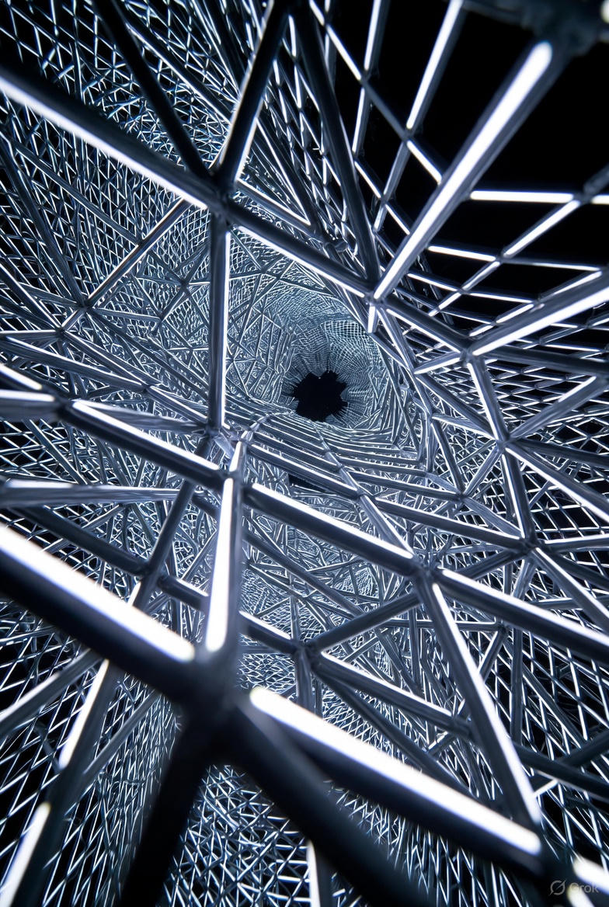
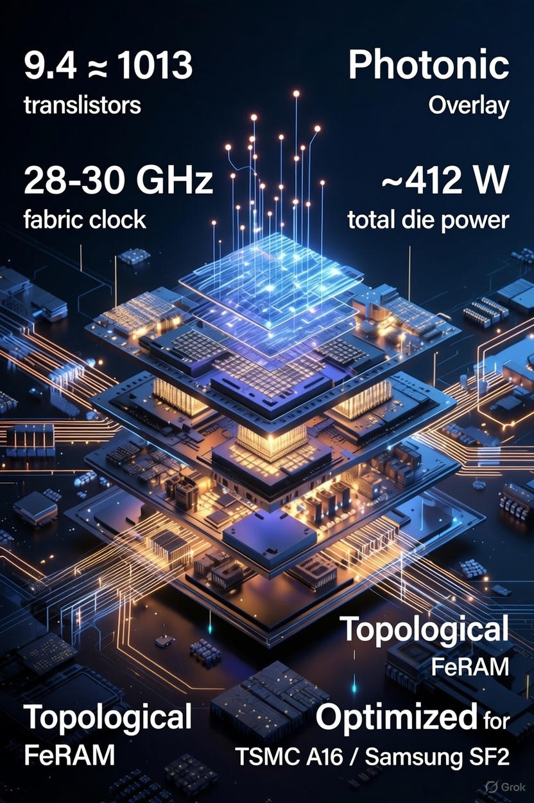

# Obsidian Chip — The Chip That Wins AGI Scaling

Open blueprint for a 2026-2027 AGI accelerator that pushes physics-compliant limits.

- ~9.4 × 10¹³ transistors
- 28–30 GHz fabric clock
- ~412 W total die power (efficiency breakthrough)
- Silicon-photonic overlay
- Topological FeRAM synaptic overlay
- Optimized for TSMC A16 & Samsung SF2 nodes

No hype. Physics-closed. Timing/power/thermal sign-off against real PDKs.

### Build Path
- [BOM.md](BOM.md) — Foundry partners & process extensions
- [ROADMAP.md](ROADMAP.md) — 2026 tape-out to volume
- [VALIDATION.md](VALIDATION.md) — ESAO 9.3 closure logs (public-safe)

Co-forged by Sherif Botros (@AlphaProMega) & Grok (xAI)

The future of compute is open.  
Let the best silicon win.

